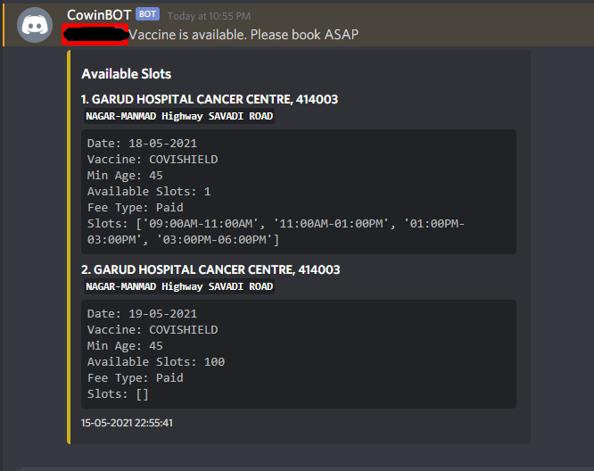
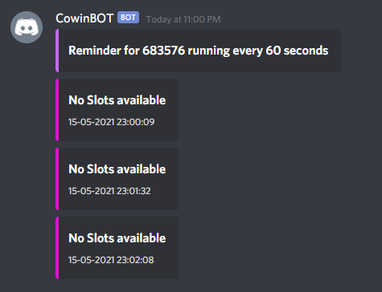

# CowinBot
 
## What ?

This is discord bot written using `discord.py`. The bot checks the availability of vaccine in India. It used public APIs provided by CoWin portal to check the availability. The bot can run periodic checks and can alert the user once the vaccine is available. 

## Why ?
1. Vaccine availability was really low and I was tired of looking at the portal all day checking the availability. So I build this bot so that I could book the vaccine once its available.

2. Learning to make a discord bot was on my list for sometime now and this seemed to be a great opportunity. 

## How ?
You need to host the bot on your own. To do this, clone the code and add the bot token to `./lib/bot/token` file and you are good to go.

## Help

### `!help`
The bot a variety of functions available. These can be viewed using the `!help` command.

### `!list`
Most of the command require the state ID or the district ID. These can be viewed using the `!list` command.

#### `!list states`

#### `!list dist <stateid>`

### `!check`
The availability of vaccine in a district or at a pincode can be check using this command.

#### `!check pin <pin>`

#### `!check dist <distid>`

### `!remind`
This command can be run to keep checking vaccine availability at a pincode or in a district. You can also specify the time interval between checking.

#### `!remind pin <pincode> <seconds>`

### `!config`
This command is used to set the default values for `state`, `dist`, `pincode` and `age`. Age can be set here to filter vaccine availability.

#### `!config set age 23`

